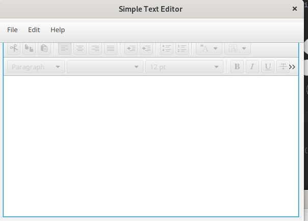

# DEP-9 TEXT Editor

A simple JavaFX editor

1. Splash Screen 

2. Text Editor Overview

3. Open a file

4. Similarly, we can save, cut, copy and paste text using this text editor

5. Print files

6. About 

### Version
v1.0.0

License
Copyright &copy; 2022 DEP-09. All Right reserved.

This project is licensed under the [MIT License](LICENSE.txt).
